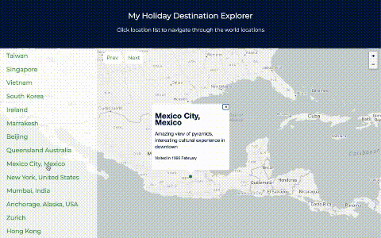

# A simple mapbox app


## Node.js version

```json
 "engines": {
    "node": ">=12.0.0",
    "npm": ">6"
  },
```

## To run front end locally

```
npm i
npm run dev
```
View on http://localhost:3000/


## How it _should_ look


## Technologies & main features

* Next.js
* React
* Node.js
* TypeScript
* Jest

